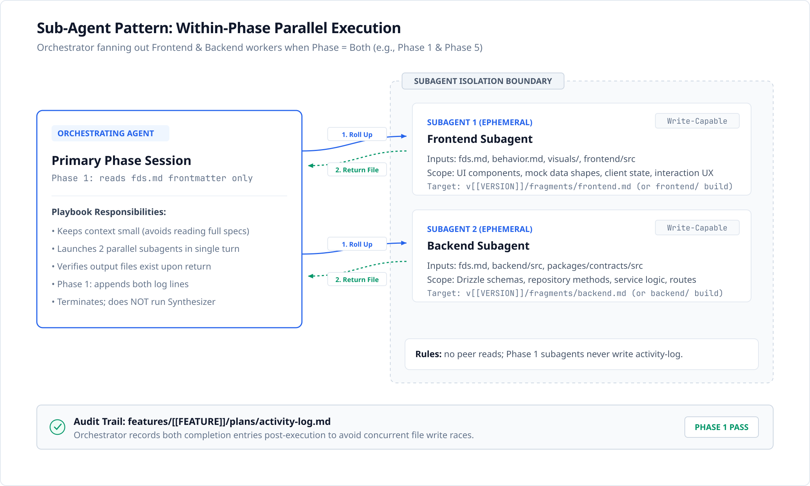
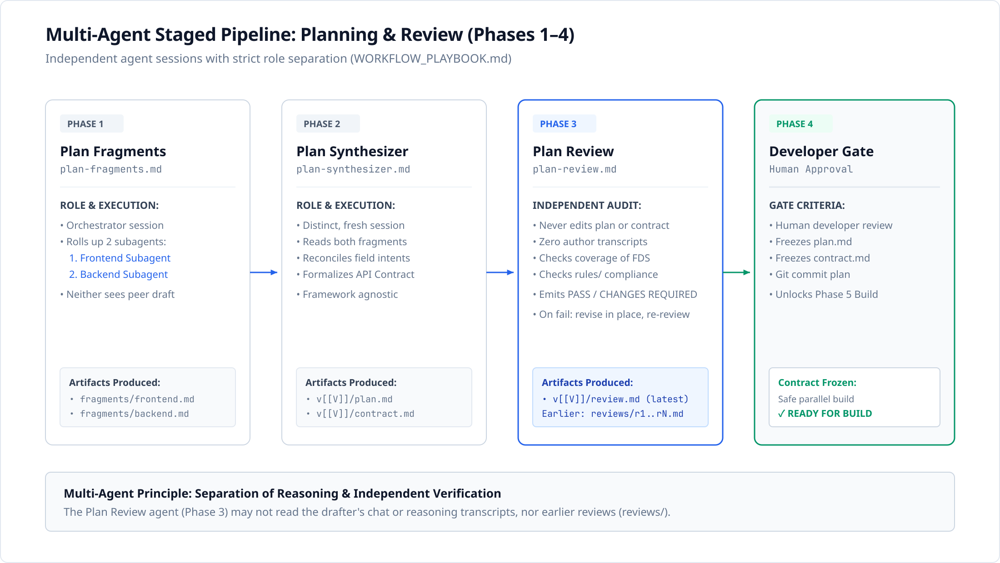
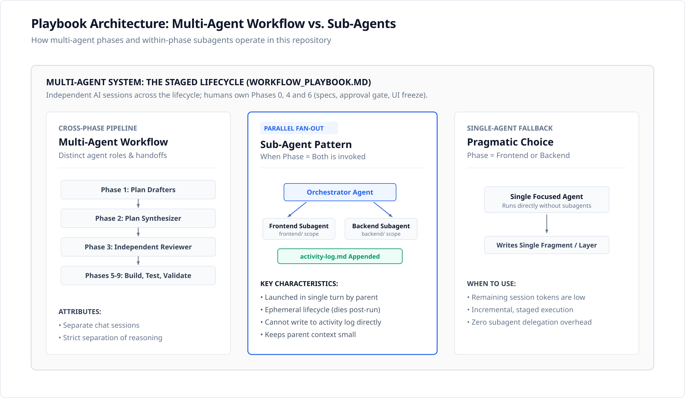

# Multi-Agent Workflow vs. Sub-Agents: Project Architecture Guide

This document clarifies the concepts of **Multi-Agent Systems (MAS)** and **Sub-Agents** as implemented in our repository's **Staged Dual-Validation Workflow with Multi-Agent Parallel Execution** (`WORKFLOW_PLAYBOOK.md` and `.ai/prompts/`).

---

## 1. Executive Summary: Core Distinction in Our Project

| Concept                  | Scope in This Repository                                                                                                                     | Key Responsibility                                                                                                                                                                                                | Lifecycle                                                                                                                                                                                      |
| :----------------------- | :------------------------------------------------------------------------------------------------------------------------------------------- | :---------------------------------------------------------------------------------------------------------------------------------------------------------------------------------------------------------------- | :--------------------------------------------------------------------------------------------------------------------------------------------------------------------------------------------- |
| **Multi-Agent Workflow** | The **Cross-Phase Pipeline** (Phases 0 through 9). Phases 0, 4 and 6 are human (spec authoring, approval gate, UI freeze); 7b and 8c are SonarQube gates. | The overall system where independent AI agent sessions execute specialized roles across the feature lifecycle, with the developer deciding at the gates.                                                          | Distinct agent sessions per agent-run phase (e.g. Plan Drafter $\rightarrow$ Plan Synthesizer $\rightarrow$ Plan Reviewer $\rightarrow$ Builders $\rightarrow$ Testers).                        |
| **Sub-Agent Pattern**    | The **Within-Phase Parallelism** (Phase 1, Phase 5 & Phase 8, each with `Phase = Both`)                                                                     | An ephemeral child worker spawned concurrently by the primary phase agent (Orchestrator) to handle a single decoupled scope (`frontend/`, `backend/`, or a test scope).                                                          | **Ephemeral**: Spawned together in a single turn, drafts, builds, or tests its bounded scope, and terminates immediately upon return.                                                                  |

> **Key Rule:**
> The overall project lifecycle is a **Multi-Agent Workflow**. Within specific phases (Phase 1 Planning, Phase 5 Build, and Phase 8 Testing), the orchestrator can roll up **Sub-Agents** to execute parallel work.

> **In One Line:**
> Every sub-agent is part of the multi-agent workflow, but not every agent in the multi-agent workflow is a sub-agent. Multi-agent is the whole pipeline of independent sessions; a sub-agent is a short-lived child that one of those sessions spawns to do part of its own phase.

> **Orchestrator Agent:**
> The orchestrator is the phase agent that spawns the sub-agents. It is part of the multi-agent workflow but is not a sub-agent itself: it splits the phase into bounded scopes, launches the sub-agents together, and after they return verifies their output and writes the shared `activity-log.md`. It does not do the sub-agents' scoped work, and sub-agents never see each other's output.

---

## 2. Architectural Topologies in Our Playbook

### Pattern 1: Sub-Agent Execution (Within-Phase Parallelism)

_Triggered when `Phase = Both` is supplied to `.ai/prompts/plan/plan-fragments.md`, `.ai/prompts/build-mode.md`, or `.ai/prompts/test-build-mode.md`:_

#### Rules common to all three phases

1. **Context Isolation:**
   - Neither subagent sees the other subagent's prompt, reasoning, or output.
   - Both subagents are launched together in a single turn and terminate when they return.
2. **Bounded write scope:** each subagent writes only inside its own boundary (listed per phase below).

#### Phase 1: Plan Fragments (`plan-fragments.md`)

1. **Context Window Hygiene:**
   - The **Orchestrating Agent** reads _only_ the `features/[[FEATURE]]/fds.md` frontmatter to determine the version, keeping its primary context small.
   - It delegates deep file searches, component inspections, and schema audits to the subagents.
2. **Scope per subagent:**
   - **Frontend Subagent**: reads `features/[[FEATURE]]/fds.md`, `behavior.md`, `visuals/`, and `frontend/src`; writes only `v[[VERSION]]/fragments/frontend.md`.
   - **Backend Subagent**: reads `features/[[FEATURE]]/fds.md`, `backend/src`, and the existing contracts package (`packages/contracts/src`, read-only for reference); writes only `v[[VERSION]]/fragments/backend.md`.
3. **Concurrency & Race-Condition Safety:**
   - Subagents MUST NOT write to `features/[[FEATURE]]/plans/activity-log.md` (concurrent writes could race and corrupt the log).
   - The Orchestrating Agent appends both activity log entries _after_ both subagents have returned.
4. **Scope Termination:**
   - The Orchestrating Agent verifies that both fragment files exist and are non-empty. It does **not** synthesize the fragments (synthesis is Phase 2, an independent agent).

#### Phase 5: Build Mode (`build-mode.md`, `Phase = Both`)

1. **Scope per subagent:**
   - **Frontend Subagent**: writes only under `frontend/`, building against mock data shaped to the frozen `v[[VERSION]]/contract.md`. It must not touch backend files.
   - **Backend Subagent**: writes only under `backend/` and `packages/contracts/`, generating the typed contracts from `v[[VERSION]]/contract.md`. It must not touch frontend files.
2. **Consistency:** the frozen `v[[VERSION]]/contract.md` is the only interface between the two subagents. Neither may change it; if it looks incomplete or ambiguous, the subagent stops and reports.
3. **Commits:** when agents share a working tree, each commit stages only the paths its phase owns (`frontend/` or `backend/ packages/contracts/`), never `git add -A` (see the playbook's _A Note on Committing Parallel Work_).

#### Phase 8: Test Build Mode (`test-build-mode.md`, `Phase = Both`)

1. **Scope per subagent:**
   - **Unit/API Test Subagent**: writes only under `backend/`, plus its own `v[[VERSION]]/defects-unit-api.md` if a genuine defect is found. It must not touch frontend or e2e files.
   - **UI/E2E Test Subagent**: writes only under `frontend/` and `e2e/`, plus its own `v[[VERSION]]/defects-ui-e2e.md` if a genuine defect is found. It must not touch backend files.
2. **Concurrency & Race-Condition Safety:** subagents MUST NOT write to `activity-log.md`; the orchestrating agent appends both lines after both subagents return (same rule as Phase 1).
3. **Commit:** one combined commit follows once both scopes finish and all tests pass, staging `backend/`, `frontend/`, `e2e/`, and `features/[[FEATURE]]/plans/` — this is unchanged from before subagents existed for this phase, only who runs it changed (see the playbook's _A Note on Committing Parallel Work_).
4. **Pragmatic choice:** `Phase = UnitAPI` or `Phase = UIE2E` runs one scope individually without spawning subagents, the same trade-off as Phase 1 and Phase 5.

> The Phase 1 and Phase 8 rules on context hygiene and the activity log are stated in `plan-fragments.md` and `test-build-mode.md` respectively. `build-mode.md` does not restate them for Phase 5, but the same exception applies (see `WORKFLOW_PLAYBOOK.md`, "A Note on the Activity Log").

---

### Pattern 2: Multi-Agent Staged Pipeline (Cross-Phase Separation of Concerns)

_Handoffs across independent agent sessions during planning and review (Phases 1–4):_

#### Why Independent Agent Sessions Are Required:

- **Phase 1 (Plan Fragments):** Orchestrator rolls up Frontend and Backend subagents to draft independent, uncompromised intent fragments.
- **Phase 2 (Plan Synthesizer):** A fresh AI session (`.ai/prompts/plan/plan-synthesizer.md`) merges both fragments into `v[[VERSION]]/plan.md` and formalizes `v[[VERSION]]/contract.md`. It has no access to the reasoning of the fragment authors.
- **Phase 3 (Plan Review):** An **independent AI agent** (`.ai/prompts/plan/plan-review.md`) audits the plan against `rules/*` and `features/[[FEATURE]]/fds.md`. It never edits the plan or the contract. It writes only `v[[VERSION]]/review.md`, archives the previous review to `reviews/r<N>.md`, and appends one line to `activity-log.md`.
  - **Strict Rule:** The reviewer is forbidden from reading prior chat transcripts, session notes, commit messages describing how the plan was produced, and earlier reviews in `reviews/`. It judges the plan solely on the written text to guarantee objective review before developer sign-off.
  - **Verdict:** `PASS` or `CHANGES REQUIRED`.
- **Phase 4 (Developer Approval Gate):** The human developer confirms the review findings and commits the frozen plan and API contract before build mode starts.

#### When Plan Review returns `CHANGES REQUIRED`

1. If the specs themselves are ambiguous, the reviewer stops and escalates. The developer decides the requirement and edits the spec.
2. Otherwise the developer records any real choices (for example in `v[[VERSION]]/directives.md`) and asks for a revision through the Plan Synthesizer or the fragments.
3. The unfrozen `plan.md` and `contract.md` are revised **in place** in the same version directory. The version is not bumped.
4. A fresh, independent review runs again. The loop is bounded by the retry policy in `rules/workflow.md` §8: after the limit, stop and escalate to the developer.

Only a `PASS` reaches the Developer Approval Gate. See `WORKFLOW_PLAYBOOK.md` (Phase 3, Revision Prompt Template) and `rules/workflow.md` §6 (Plan Artifact Layout).

#### Why Phases 1, 2 and 3 Are Not Merged Into One Orchestrator

A single orchestrator could in principle draft the fragments, synthesize the plan, and review it in one run. We deliberately do not do this:

1. **The reviewer must not be the author.** Phase 3 is valuable only because the reviewer judges the written plan without knowing how it was produced. An agent that coordinated or wrote the plan carries its own assumptions and blind spots into the review and tends to approve its own work, so its `PASS` is weak evidence going into the Developer Approval Gate. This is the strongest reason and is not negotiable.
2. **The orchestrator's context is kept small on purpose.** Phase 1 has it read only the `fds.md` frontmatter and delegate deep reads to the subagents. Synthesis needs the full FDS, both fragments and `rules/`, which would undo that hygiene and crowd out the checking the later phases depend on.
3. **The Synthesizer works from written output only.** It has no access to the fragment authors' reasoning. An orchestrator that has just run the fan-out is more likely to fill gaps from what it remembers asking the subagents rather than from what the fragments actually say.
4. **The revision loop needs a fresh review each time.** After `CHANGES REQUIRED`, the plan is revised in place and re-reviewed. One long session remembers its earlier verdicts, so it cannot give a fresh, independent second review.
5. **The saving is small and failures cost more.** Merging removes a cold session start, but a longer session costs more tokens and a failure late in it means redoing planning as well as review.

If the goal is fewer manual steps, chain Phases 1 → 2 → 3 with a wrapper script or a documented command sequence that starts each phase as its own session, rather than merging the roles.

---

### Pattern 3: Playbook Architecture Taxonomy

_How multi-agent phases, subagent fan-outs, and single-agent fallback relate in our repository:_

---

## 3. Comparison Matrix: Workflow vs. Sub-Agents

| Dimension             | Multi-Agent Workflow (The System)                                                                                                            | Sub-Agent (Within-Phase Pattern)                                                              |
| :-------------------- | :------------------------------------------------------------------------------------------------------------------------------------------- | :-------------------------------------------------------------------------------------------- |
| **Where Defined**     | `CLAUDE.md`, `rules/workflow.md`, and `WORKFLOW_PLAYBOOK.md` (Phases 0 through 9)                                                            | `.ai/prompts/plan/plan-fragments.md`, `.ai/prompts/build-mode.md` & `.ai/prompts/test-build-mode.md`                            |
| **Execution Scope**   | Across entire feature lifecycle                                                                                                              | Within a single phase run (`Phase = Both`)                                                    |
| **Session Boundary**  | Distinct sessions per agent-run phase; Phases 0, 4 and 6 are human                                  | Child threads rolled up in a single turn by the phase session                                 |
| **Subordinate Role**  | None; each phase agent has specialized authority (e.g. Reviewer can fail a plan)                                                             | Subordinate to Orchestrator; completes task and returns file                                  |
| **Context Access**    | Plan Synthesizer has no access to the fragment authors' reasoning; Plan Review is forbidden from reading transcripts and earlier reviews. Other phases work from the written files | Isolated; cannot read peer subagent output                                                    |
| **Commit / Log Rule** | Concurrent work stages only phase-owned paths; planning, review, test and diagnosis agents append one line to `activity-log.md`              | Phase 1 subagents are forbidden from writing `activity-log.md`; the orchestrator writes it    |

---

## 4. When to Use Sub-Agents vs. Single-Agent ("Pragmatic Choice")

As documented in `WORKFLOW_PLAYBOOK.md` (Section: _When to Use the Simple Path Instead_), the amount of multi-agent machinery follows the feature's complexity score (`rules/workflow.md` §5):

| Score            | Path                                                                                                                                          |
| :--------------- | :-------------------------------------------------------------------------------------------------------------------------------------------- |
| **0–2 (low)**    | Simple sequential path: `plan-mode.md`, then Build with `Phase = Frontend` → `Backend` → `Integration`, then Validation.                      |
| **3–4 (medium)** | Adds Plan Review and parallel Test sessions, but keeps Build sequential.                                                                      |
| **5–6 (high)**   | Full pipeline: parallel plan fragments, Plan Review, parallel builds (`Phase = Both`), and parallel tests.                                    |

### Use Sub-Agents (`Phase = Both`):

- For high-complexity features where parallel frontend and backend work cuts session time.
- When remaining session token limits are sufficient for a parallel fan-out.

### Use Single-Agent Mode (`Phase = Frontend` or `Phase = Backend`):

- **Pragmatic Choice (Low Tokens):** Run a single focused agent on one layer without spawning subagents.
- **Simple Features:** Small, single-layer changes do not require multi-agent fan-out or subagent overhead.

---

## 5. Related Reading

The separation between orchestrators, workers, and staged verification in our playbook is in the same family as these published patterns. They are background reading, not evidence that this workflow is optimal.

### 1. Industry Engineering Blueprints

- **Anthropic — [Building Effective Agents](https://www.anthropic.com/research/building-effective-agents)** (Dec 2024)
  - Describes the **orchestrator-workers** workflow, in which a central agent delegates subtasks to workers, and advises adding multi-agent complexity only when simpler solutions fall short.
- **LangChain / LangGraph — [Multi-Agent Architectures](https://langchain-ai.github.io/langgraph/concepts/multi_agent/)**
  - Describes supervisor and hierarchical multi-agent architectures and handoffs between agents.
- **OpenAI — [Orchestrating Agents with Routines & Handoffs](https://cookbook.openai.com/examples/orchestrating_agents)** / [OpenAI Agents SDK](https://github.com/openai/openai-agents-python)
  - Describes role-specialized agents and handoffs between them.

### 2. Research Papers

- **Multi-agent cross-checking:**
  - **[Improving Factuality and Reasoning in Language Models through Multiagent Debate](https://arxiv.org/abs/2305.14325)** (Du et al., ICML 2024)
  - Multiple model instances debate and refine answers, with reported gains in factuality and reasoning. Our Phase 3 review is an independent audit rather than a debate, but it rests on the same intuition that independent cross-checking reduces single-agent blind spots.
- **Multi-agent frameworks for software engineering:**
  - **[AutoGen: Enabling Next-Gen LLM Applications via Multi-Agent Conversation](https://arxiv.org/abs/2308.08155)** (Wu et al., Microsoft Research, 2023)
  - A framework for building applications from multiple conversing agents with structured handoffs.
  - **[MetaGPT: Meta Programming for A Multi-Agent Collaborative Framework](https://arxiv.org/abs/2308.00352)** (Hong et al., ICLR 2024)
  - Encodes standard operating procedures as role separation across software-development stages (requirements, design, code, review) and reports improved results on its benchmarks.
